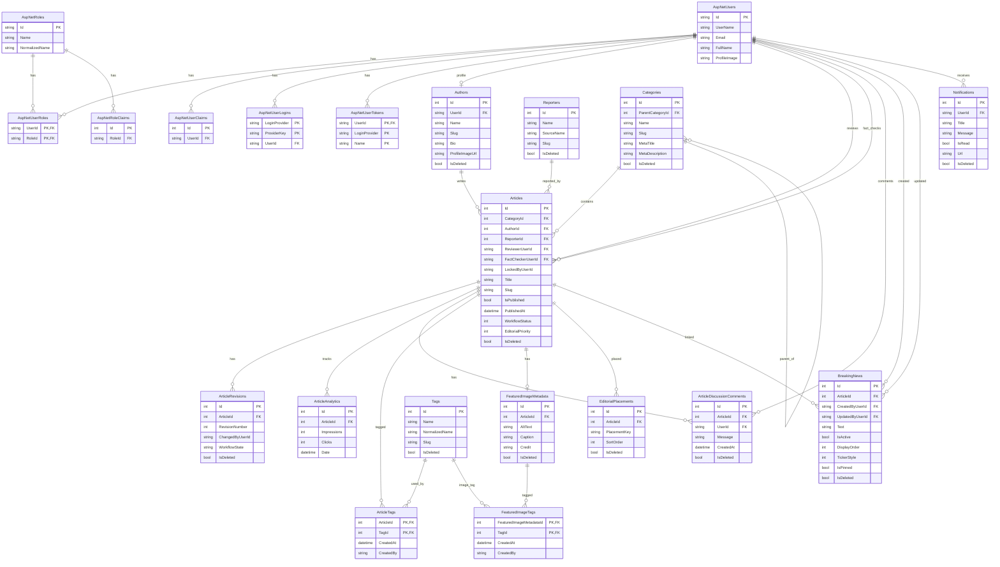

# BolNews Database Diagram

This diagram is based on the current EF Core model in `AppDbContext`, entity classes, and persistence configurations.

## Relationship Notes

- `Authors.UserId` is a one-to-one profile link to `AspNetUsers.Id`.
- `Articles.AuthorId` is required and points to `Authors.Id`.
- `Articles.CategoryId` is required and points to `Categories.Id`.
- `Articles.ReporterId` is optional and points to `Reporters.Id`; deleting a reporter sets article `ReporterId` to `NULL`.
- `Articles.ReviewerUserId` and `Articles.FactCheckerUserId` point to `AspNetUsers.Id` by convention.
- `ArticleTags` is the article/tag join table.
- `FeaturedImageTags` is the featured-image/tag join table.
- `FeaturedImageMetadata.ArticleId` is unique, making it a one-to-one article image metadata link.
- `EditorialPlacements.ArticleId` links homepage placement records to articles.
- `BreakingNews.ArticleId` is optional and points to articles.
- `Notifications.UserId` points to `AspNetUsers.Id` by convention.
- Identity tables are included because `AppDbContext` inherits from `IdentityDbContext<ApplicationUser>`.
